<div align="center">


# 智慧考試系統

**離線優先、跨平台的資訊類證照練習平台 — 內建程式碼執行環境與 AI 助教。**

`TQC+` · `CPE` · `APCS` · `電腦軟體設計丙級技術士`

[](https://dotnet.microsoft.com/)
[](https://avaloniaui.net/)
[](https://www.sqlite.org/)
[]()

[English](README.md) · **繁體中文**

</div>

---

## 啟發原因

因應時代的快速發展，軟體工程師不再侷限於大學所學的技能。為了更準確地評估個人實力，企業常會參考 LeetCode、CPE、TQC 等證照。然而困境在於：每個人的時間有限，平日除了工作，還要應付各種繁忙事務，更需要支付大筆金錢給考照機構報名與學習。

**智慧考試系統** 正是為了解決這些痛點而生 —— 所有題庫皆儲存在本地、整個程式無需網路即可運行，並內建 AI 助教協助檢視程式碼。讓你隨時、在任何作業系統上，免費練習。

---

## 畫面預覽

### 開始畫面 — 快速模擬
選擇考照類型即可立即開始練習，熱門題庫卡片即時顯示進度。

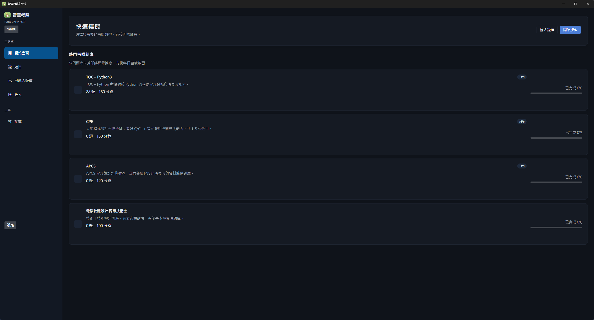

### 模擬考試設定
開始前可確認題庫、題數、考試時間與作答語言。

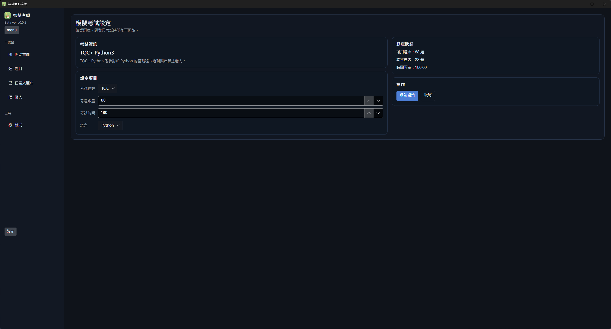

### 考試中 — 內建 IDE
實際可運行的程式碼工作區，搭配計時器、隨機抽題、檔案清單與「提交驗證」按鈕。

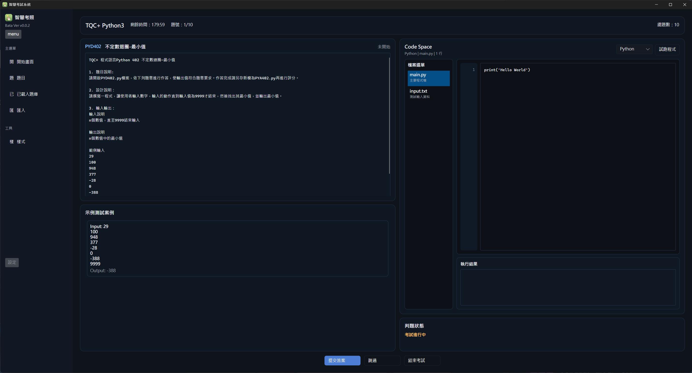

### 結算與 AI 助教
顯示成績、答對率與花費時間。可向 AI 提問，或一鍵分析程式碼的漏洞與寫法問題 —— 全部整合在同一面板。

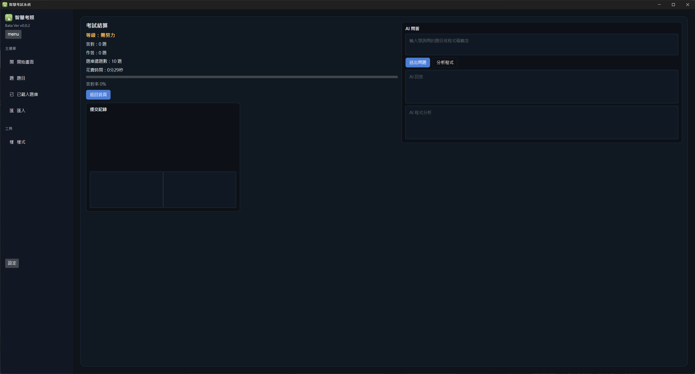

<details>
<summary><b>更多畫面</b>（題目瀏覽、題庫管理、匯入、設定）</summary>

<br/>

| 題目瀏覽 | 已載入題庫 |
| :---: | :---: |
| 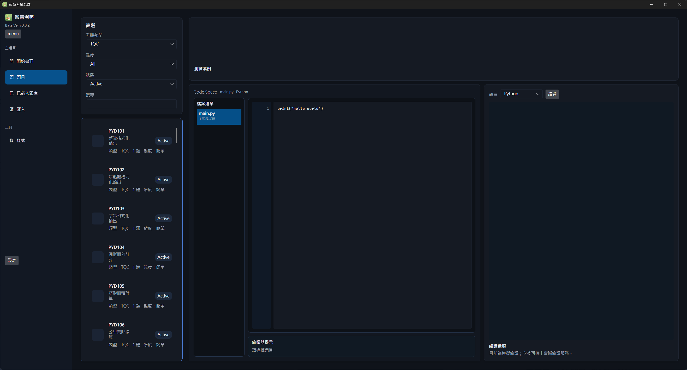 | 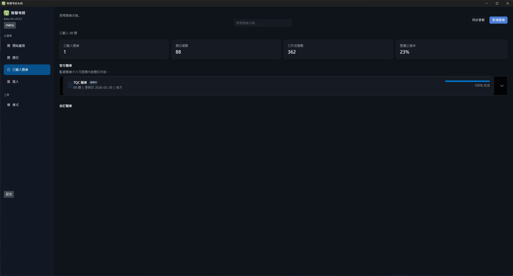 |
| 依考照類型 / 難度 / 狀態篩選，預覽並編輯解法程式碼。 | 追蹤已載入題庫、題目總數、作答題數與整體正確率。 |

| 匯入題庫 | 樣式設定 |
| :---: | :---: |
| 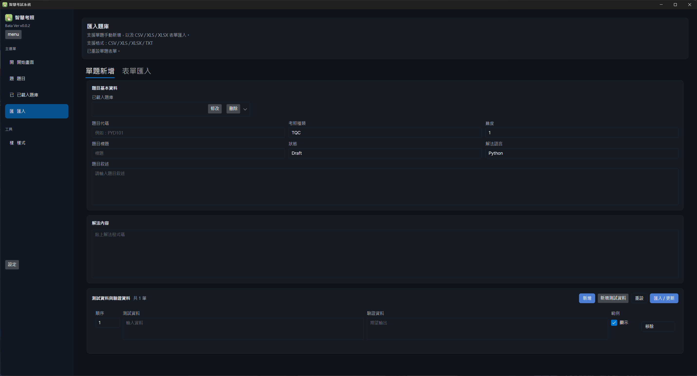 | 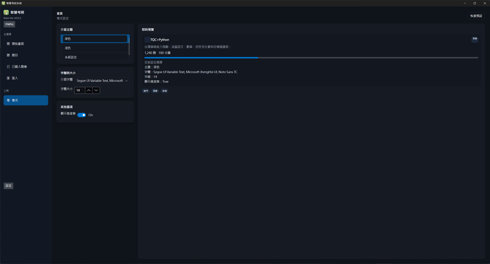 |
| 可單題新增，或以 CSV / XLS / XLSX / TXT 批次匯入。 | 即時預覽下切換主題、字型與字級。 |

| 考試行為 | AI 模型 | 資料管理 |
| :---: | :---: | :---: |
| 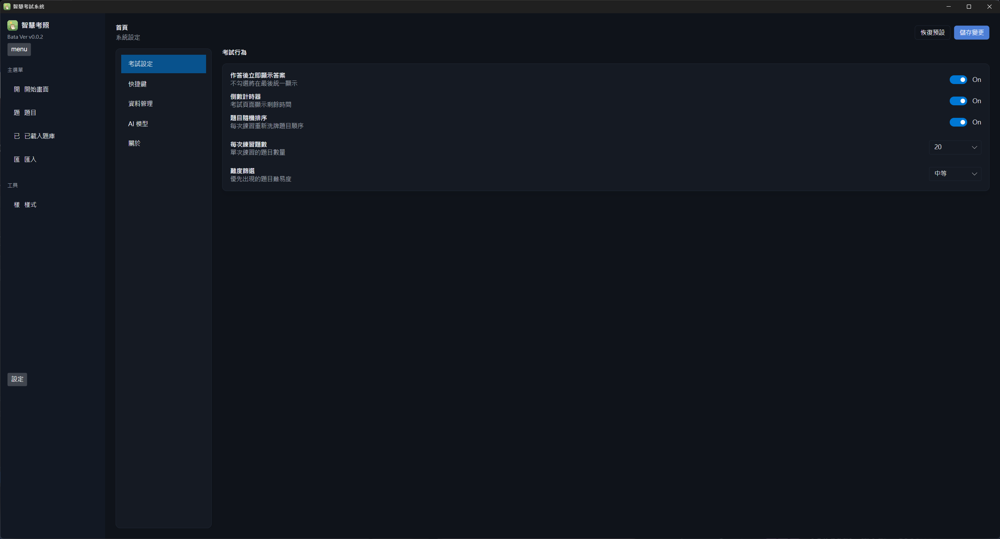 | 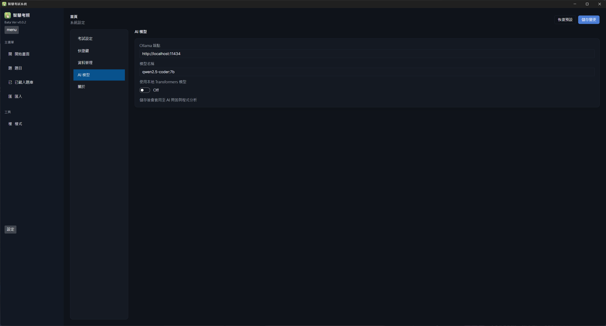 | 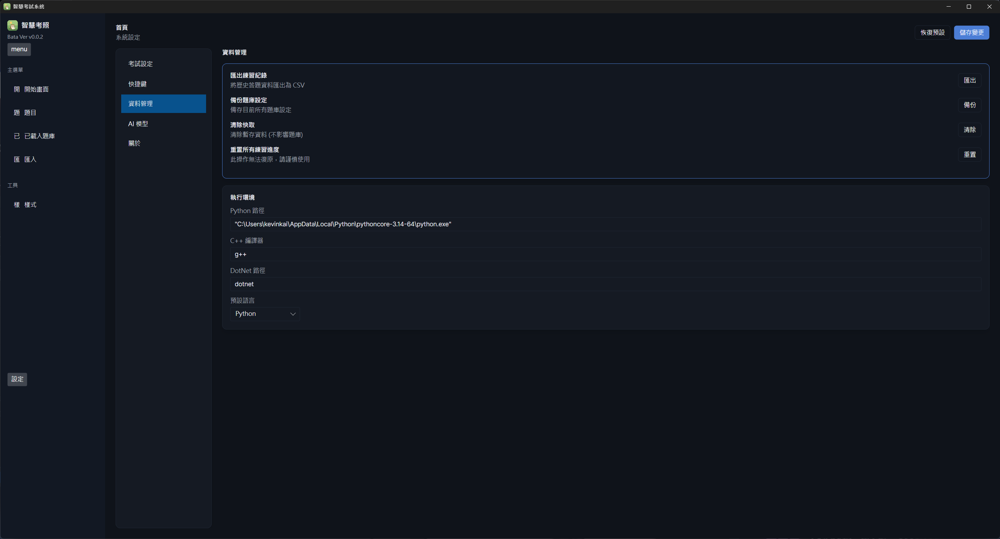 |
| 切換即時顯示答案、倒數計時、隨機排序與難度。 | 設定 Ollama 端點或本地 Transformers 模型。 | 匯出紀錄、備份題庫並設定編譯器路徑。 |

</details>

---

## 軟體特點

- ** 無網路環境可執行** —— 所有題庫皆為本地儲存，使用 **SQLite** 進行規劃及管理，全程無需連網。
- ** 多系統泛用** —— 不管你是 Linux、macOS 還是 Windows，因 **Avalonia** 框架所帶來的便利性，發出 Release 時可在全部環境執行（含 Intel 與 Apple Silicon）。
- ** 多種編譯方式通用** —— 提供 **Python、C/C++、C#** 等執行路徑供編譯及測試，判題引擎會實際執行你的程式碼並比對輸出是否與預期一致。
- ** 內建 AI 助教** —— 串接本地 **Ollama** 模型（預設 `qwen2.5-coder:7b`）或本地 Transformers 模型，可進行問答與一鍵程式碼分析，無需 API Key。
- ** 進度追蹤** —— 一眼掌握各題庫進度、作答題數與整體正確率。
- ** 彈性匯入** —— 可單題新增，也可從 `CSV` / `XLS` / `XLSX` / `TXT` 批次匯入，並支援單題多筆測試資料。

---

## 快速開始

### 安裝（推薦）

1. 開啟旁邊的 **[Releases](../../releases)** 頁面。
2. 找到自己的系統版本（`windows` / `linux` / `macOS-x64` / `macOS-arm64`）並下載。
3. 解包至資料夾並執行 —— **Enjoy！**

### 設定編譯路徑

進入 **設定 → 資料管理 → 執行環境**，依自己的系統設定路徑：

| 執行環境 | 預設值 | 說明 |
| --- | --- | --- |
| Python | `python` / `python.exe` 完整路徑 | Python 題目所需 |
| C++ | `g++` | C/C++ 題目所需 |
| .NET | `dotnet` | C# 題目所需 |

### （選用）啟用 AI 助教

1. 安裝 [Ollama](https://ollama.com/) 並下載模型，例如 `ollama pull qwen2.5-coder:7b`。
2. 於 **設定 → AI 模型** 確認端點（`http://localhost:11434`）與模型名稱。

---

## 從原始碼建置

**前置需求：** [.NET 10 SDK](https://dotnet.microsoft.com/download)。

```bash
git clone https://github.com/<你的帳號>/Information-related-license-exam-practice-system.git
cd Information-related-license-exam-practice-system/desktop/B3

# 執行
dotnet run

# 發布所有平台（於專案根目錄以 PowerShell 執行）
pwsh ../../package.ps1
```

`package.ps1` 會產生 `win-x64`、`linux-x64`、`osx-x64`、`osx-arm64` 的 self-contained 壓縮包（macOS 版本會封裝成 `.app` bundle）。

---

## 技術框架

| 層級 | 技術 |
| --- | --- |
| UI 框架 | Avalonia 12.0（Fluent 主題），以 CommunityToolkit.Mvvm 實作 MVVM |
| 執行環境 | .NET 10.0 |
| 資料庫 | SQLite（透過 Entity Framework Core 8） |
| 試算表匯入 | NPOI |
| AI 後端 | Ollama（本地）/ 本地 Transformers 模型 |
| 程式碼判題 | 外部 Python / g++ / dotnet 程序 |

---

## 題庫匯入格式

匯入頁面支援兩種方式：

- **單題新增**：直接輸入題目代碼、考照種類、題目敘述、解法程式碼，以及多筆測試資料與驗證資料。
- **表單匯入**：支援 `.csv`、`.xls`、`.xlsx`，每一列代表一筆測試資料；相同 `ProblemCode` 的列會合併成同一題。

### 欄位規格

匯入表單請依下列欄位順序建立：

```
ProblemCode, ExamType, Title, Description, Difficulty, Status,
SolutionLanguage, SolutionCode, OrderIndex, IsExample, TestInput, ExpectedOutput
```

### 範例值

| 欄位 | 範例 |
| --- | --- |
| `ProblemCode` | `PYD101` |
| `ExamType` | `TQC` |
| `Difficulty` | `1 / 2 / 3` 或 `簡單 / 中等 / 困難` |
| `Status` | `Draft` 或 `Active` |
| `IsExample` | `True / False`、`是 / 否` |

>  在應用程式的「匯入題庫」頁面可直接下載 CSV 模板，下載後可用 Excel、LibreOffice 或其他試算表工具編輯，再匯入系統。

---

## 參考

- **EZTest** —— 英文考照
- **TronClass** —— 大學學習網站
- 啟發本專案的考照電腦補習班

---

<div align="center">
<sub>以 Avalonia 打造 · 獻給寧願動手練習也不想付大錢的學習者。</sub>
</div>
